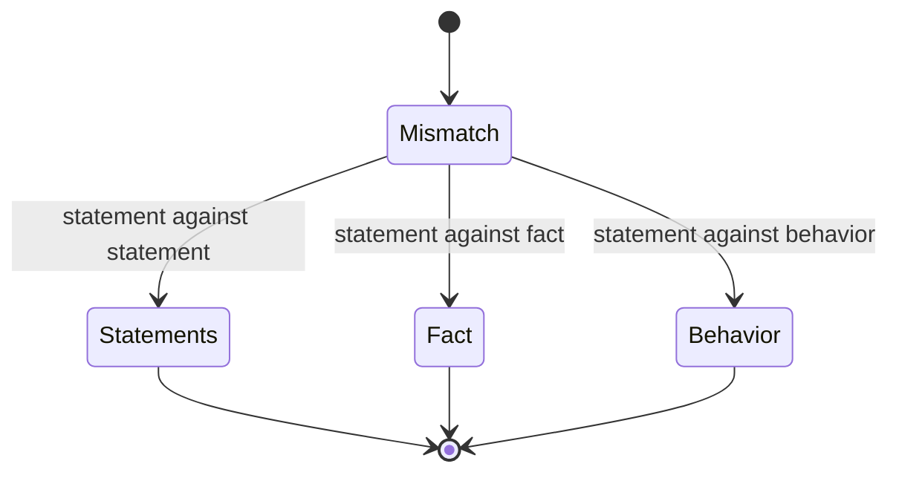

# contradiction

```mermaid
stateDiagram-v2
  [*] --> Mismatch
  state Mismatch <<choice>>
  Mismatch --> Statements: statement against statement
  Mismatch --> Fact: statement against fact
  Mismatch --> Behavior: statement against behavior
  Statements --> [*]
  Fact --> [*]
  Behavior --> [*]
```

A contradiction is a mismatch.

- Statement against statement.
- Statement against fact.
- Statement against behavior.
